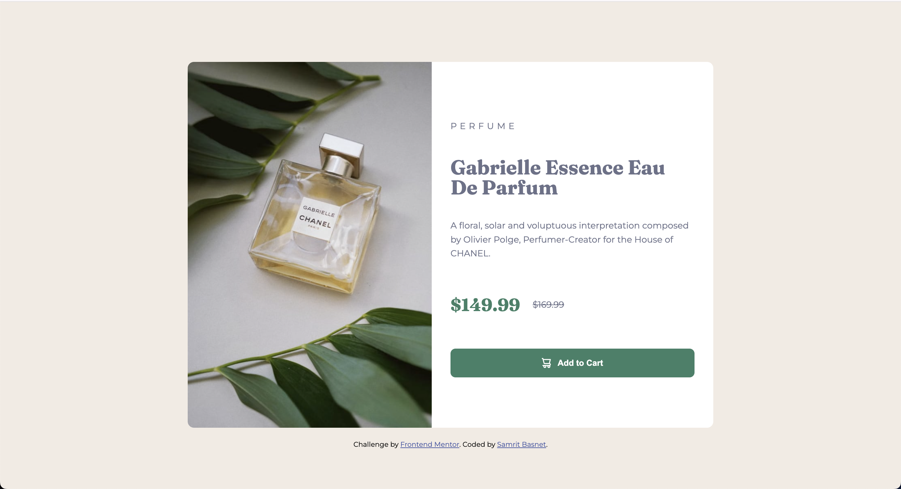

# Frontend Mentor - Product preview card component solution

This is a solution to the [Product preview card component challenge on Frontend Mentor](https://www.frontendmentor.io/challenges/product-preview-card-component-GO7UmttRfa). Frontend Mentor challenges help you improve your coding skills by building realistic projects.

## Overview

### The challenge

Users should be able to:

- View the optimal layout depending on their device's screen size
- See hover and focus states for interactive elements

### Screenshot



### Links

- Solution URL: [Add solution URL here](https://github.com/samritbasnet/Product-preview-card-component)

## My process

### Built with

- Semantic HTML5 markup
- CSS custom properties
- Flexbox
- CSS Grid
- Mobile-first workflow

### What I learned

I learned to used media query and provide correct width and sizing based on device also to use flex property
To see how you can add code snippets, see below:

```css

@media screen and (max-width: 375px) {
  body {
    padding: 10px;
  }

  .main {
    max-width: 100%;
  }

  .img-container {
    height: 200px;
  }

  .content {
    padding: 15px;
  }


**Note: Delete this note and replace the list above with resources that helped you during the challenge. These could come in handy for anyone viewing your solution or for yourself when you look back on this project in the future.**

## Author

- Frontend Mentor - [@yourusername](https://www.frontendmentor.io/profile/samritbasnet)
- Twitter - [@yourusername](https://www.twitter.com/samritbasnet70)

```
